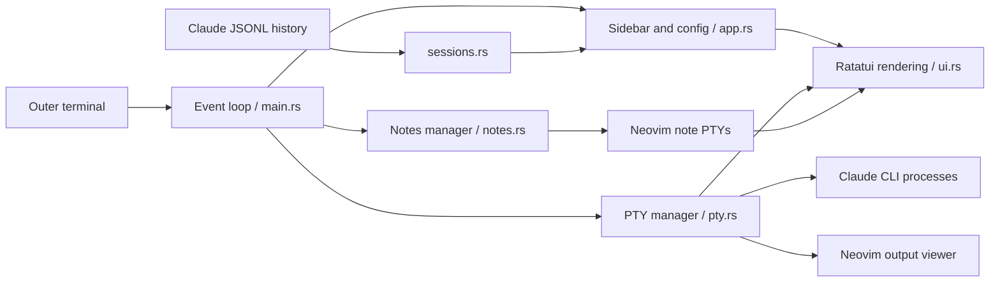

# Architecture

Claude Code remains an independent CLI process. The TUI manages PTYs and local
UI state, preserving Claude's authentication and permission prompts.

## Modules

| Module | Responsibility |
| --- | --- |
| `main.rs` | Events, global shortcuts, focus, clipboard, temporary snapshots |
| `app.rs` | Project rows, selected IDs, local overrides, live-state reconciliation |
| `pty.rs` | Child processes, vt100 screens, resizing, input encoding and selection |
| `sessions.rs` | History scan, latest customTitle/aiTitle, size/mtime cache |
| `new_chat.rs` | Modal project selection and directory browsing |
| `notes.rs` | Markdown files, migration and per-session editor visibility |
| `config.rs` | XDG JSON configuration and replacement writes |
| `theme.rs`, `ui.rs` | Terminal palette, layout, panels and cursor placement |

## Sessions and titles

New chats receive a UUID passed with `claude --session-id=<id>`. Existing chats
use `claude --resume=<id>`. PTYs are keyed by session ID; selecting a running
session reuses its process. Open entries appear before Claude writes history.
Closing a PTY removes it from the open list but leaves persisted history/notes.

History is polled every two seconds outside modal/text input and after process
completion. Selected rows are reconciled by session ID. The last nonempty
`customTitle` takes priority over `aiTitle`; a changed CLI custom title clears an
older TUI-local override. Local titles otherwise stay in the TUI configuration.

## Input and selection

Exact Alt shortcuts belong to the TUI; modified native CLI keys are encoded for
the PTY. Keyboard enhancement and paste/mouse modes are restored on exit.
Mouse coordinates are translated to child viewport coordinates.

A left drag snapshots only the active child screen, clamps endpoints to its inner
viewport and highlights with terminal-color inversion. Release copies selected
rows via a clipboard helper or OSC 52. It never scrapes the outer terminal.
The output viewer independently snapshots the active Claude screen and retained
scrollback into a private temporary file and opens it in a dedicated Neovim PTY.

## Notes and lifecycle

Notes live in `~/knowledge-base/claude-code-tui/notes/<session-id>.md`.
Existing XDG notes are copied on open without overwrite. Hidden editor PTYs keep
unsaved buffers; visibility follows the active chat. Exiting asks Neovim editors
to `:confirm qall` and waits for them. Output-viewer snapshots are disposable;
normal close removes them. See [security boundaries](../SECURITY.md).
