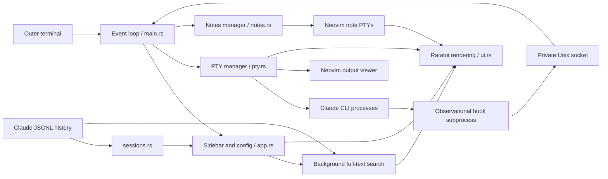

# Architecture

Claude Code remains an independent CLI process. The TUI manages PTYs and local
UI state, preserving Claude's authentication and permission prompts.

## Modules

| Module | Responsibility |
| --- | --- |
| `events.rs` | Private local hook transport, activity states and notification worker |
| `commands.rs`, `workspace.rs` | Shared action registry and fuzzy modal navigation |
| `search.rs` | Cancellable bounded transcript/Markdown search worker |
| `main.rs` | Events, global shortcuts, focus, clipboard, temporary snapshots |
| `app.rs` | Project rows, selected IDs, local overrides, live-state reconciliation |
| `pty.rs` | Child processes, vt100 screens, resizing, input encoding and selection |
| `sessions.rs` | History scan, latest customTitle/aiTitle, size/mtime cache |
| `new_chat.rs` | Modal project selection and directory browsing |
| `notes.rs` | Markdown files, migration and per-session editor visibility |
| `config.rs` | XDG JSON configuration and replacement writes |
| `theme.rs`, `ui.rs` | Terminal palette, layout, panels and cursor placement |

## Sessions and titles

New chats receive a UUID passed with `claude --session-id=<id>`. Existing chats
use `claude --resume=<id>`. PTYs are keyed by session ID; selecting a running
session reuses its process. Open entries appear before Claude writes history.
Closing a PTY removes it from the open list but leaves persisted history/notes.

History is polled every two seconds outside modal/text input and after process
completion. The selected transcript path is retained so search uses the same
file as the sidebar when duplicate IDs exist. Selected rows are reconciled by session ID. The last nonempty
`customTitle` takes priority over `aiTitle`; a changed CLI custom title clears an
older TUI-local override. Local titles otherwise stay in the TUI configuration.

## Input and selection

Exact Alt shortcuts belong to the TUI; modified native CLI keys are encoded for
the PTY. Keyboard enhancement and paste/mouse modes are restored on exit.
Mouse coordinates are translated to child viewport coordinates. Alt+1…4 panel
selection precedes modals, the output viewer and both child input paths. Scoped
launcher overrides make Ghostty/Kitty tab bindings deliver panel keys; direct
terminal launches cannot bypass external bindings.

A left drag snapshots only the active child screen, clamps endpoints to its inner
viewport and highlights with terminal-color inversion. Release copies selected
rows via a clipboard helper or OSC 52. It never scrapes the outer terminal.
The output viewer independently snapshots the active Claude screen and retained
scrollback into a private temporary file and opens it in a dedicated Neovim PTY.

## Notes and lifecycle

Notes live in `~/knowledge-base/claude-code-tui/notes/<session-id>.md`.
Existing XDG notes are copied on open without overwrite. Hidden editor PTYs keep
unsaved buffers; visibility follows the active chat. Exiting asks Neovim editors
to `:confirm qall` and waits for them. Output-viewer snapshots are disposable;
normal close removes them. See [security boundaries](../SECURITY.md).

## Activity, search and layout

Each Claude PTY receives additive observational hooks via inline `--settings`.
The hook subprocess sends only session/event/notification/prompt identifiers to
an instance-private Unix datagram socket. No decision output or user settings
writes occur. Only currently running registered session IDs update activity.
Unknown status is retained when hooks do not fire. Unread markers clear when
an unobscured dialogue is shown. Notification subprocesses run on a bounded
worker and have a two-second timeout.

Workspace popups intercept input ahead of child PTYs; commands and help share
one registry. Search reads only saved message text and Markdown in a cancellable
worker with explicit bounds, keeping snippets in memory. Note append operations
use the running editor buffer when present. Layout percentages live in XDG
config; maximizing is temporary and does not replace saved proportions.

## Named workspace lifecycle

`saved_workspaces.rs` stores bounded named snapshots in the existing private XDG
configuration: chat UUID/project/title/transcript references, active UUID, visible
notes, model override, focus and layout. No transcript or editor-buffer copies are
stored. Configuration failures roll back in-memory snapshot edits.

The manager uses the shared popup routing and Alt+O/Щ registry action. Closing or
restoring is confirmed first, then waits for all Neovim editors to complete
`:confirm qall`. CLI PTYs are stopped only after that barrier. Global focus keys
cancel the pending action; quitting cancels it before requesting application exit.
Restore preflights directories/UUIDs, launches CLI PTYs with resume for existing
transcripts (session-id for fresh chats), reopens notes and selects the saved UUID.
Partial launch failures leave the snapshot available and report individual errors.
Three mouse dividers persist sidebar width, left-panel split and chat/note split;
a zero left split retains the previous six-row open-chats layout for old configs.
